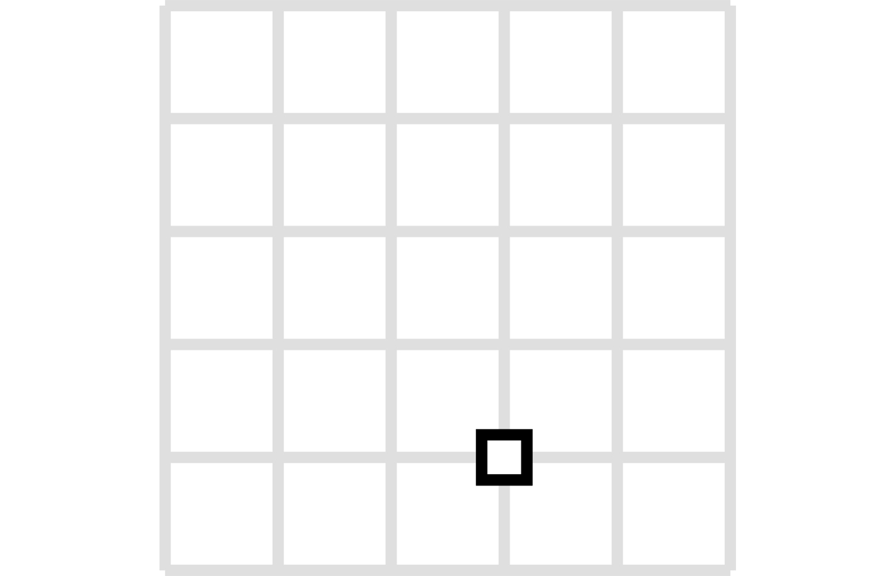
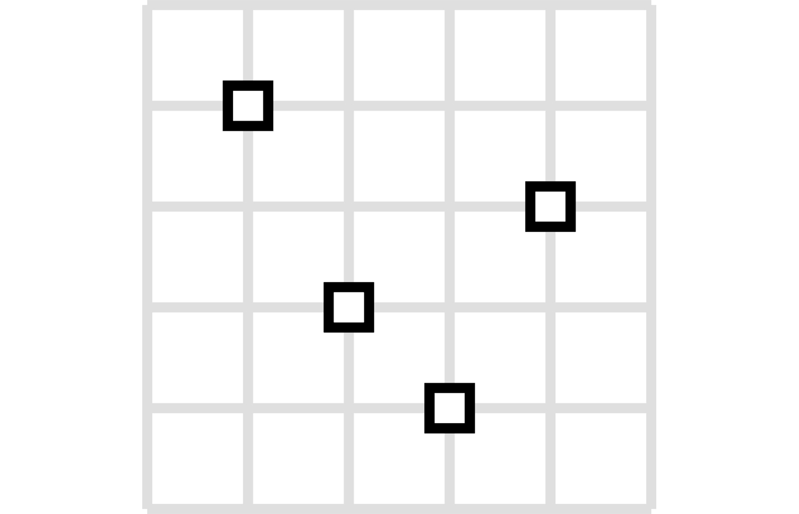
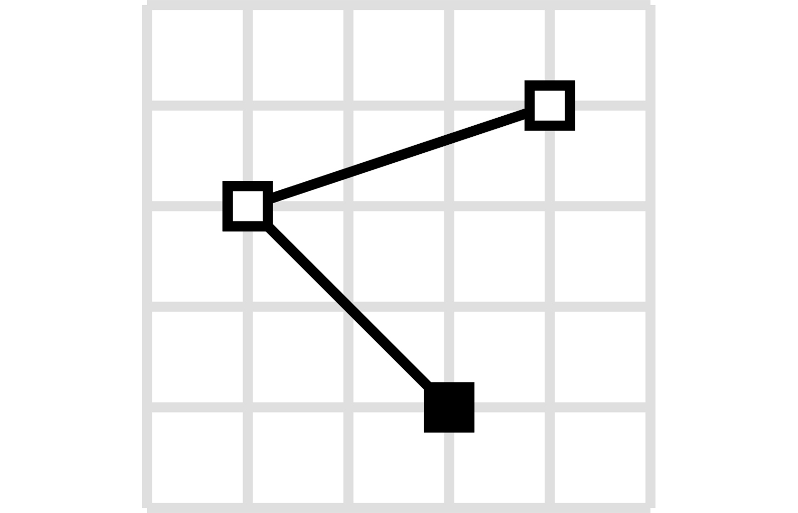
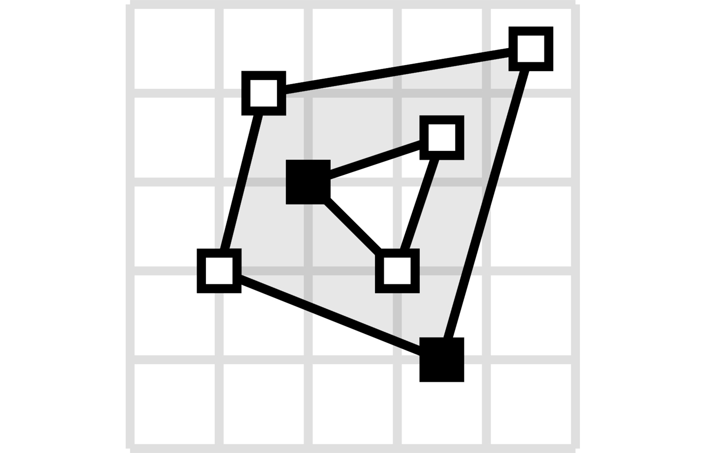
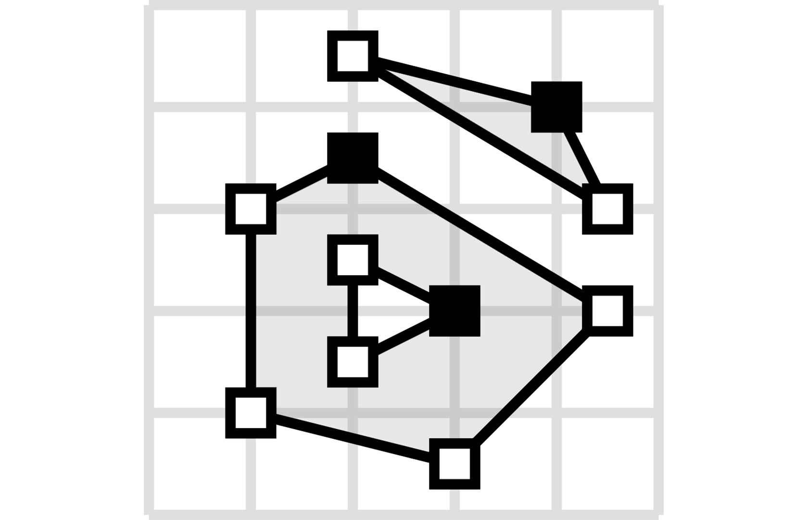
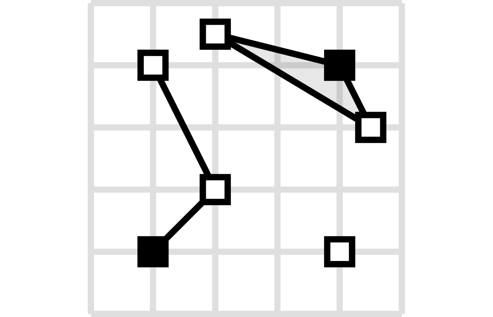

[](https://github.com/gb-libs/pydantic-geojson/actions?query=workflow%3A%22Python+package%22)
[](https://pypi.org/project/pydantic-geojson/)
[](https://codecov.io/gh/gb-libs/pydantic-geojson)
[](https://pepy.tech/project/pydantic-geojson)

# pydantic-geojson 🌍

A type-safe, Pydantic-based library for validating and working with [GeoJSON](https://geojson.org/) data according to [RFC 7946](https://tools.ietf.org/html/rfc7946) specification.


## Supported GeoJSON Objects

| GeoJSON Objects    | Status | Description |
|--------------------|--------|-------------|
| Point              | ✅      | A single geographic coordinate |
| MultiPoint         | ✅      | Multiple points |
| LineString         | ✅      | A sequence of connected points forming a line |
| MultiLineString    | ✅      | Multiple line strings |
| Polygon            | ✅      | A closed area, optionally with holes |
| MultiPolygon       | ✅      | Multiple polygons |
| GeometryCollection | ✅      | Collection of different geometry types |
| Feature            | ✅      | Geometry with properties |
| FeatureCollection  | ✅      | Collection of features |

## Installation

pydantic-geojson is compatible with Python 3.9 and up.

The recommended way to install is via [poetry](https://python-poetry.org/):

```shell
poetry add pydantic_geojson
```

Using pip to install is also possible:

```shell
pip install pydantic_geojson
```

## Quick Start

```python
from pydantic_geojson import PointModel

# Create a point
point = PointModel(
    type="Point",
    coordinates=[-105.01621, 39.57422]
)

print(point)
# type='Point' coordinates=Coordinates(lon=-105.01621, lat=39.57422)
```

## GeoJSON Types with Visualizations

<table style="width: 100%;">
<thead>
<tr>
<th style="width: 20%;">Type</th>
<th style="width: 20%; text-align: center;">Visualization</th>
<th style="width: 60%;">Usage</th>
</tr>
</thead>
<tbody>
<tr>
<td><strong>Point</strong><br>A single geographic coordinate</td>
<td style="text-align: center;"></td>
<td>

```python
from pydantic_geojson import PointModel

data = {
    "type": "Point",
    "coordinates": [-105.01621, 39.57422]
}
point = PointModel(**data)
```

</td>
</tr>
<tr>
<td><strong>MultiPoint</strong><br>Multiple points</td>
<td style="text-align: center;"></td>
<td>

```python
from pydantic_geojson import MultiPointModel

data = {
    "type": "MultiPoint",
    "coordinates": [
        [-105.01621, 39.57422],
        [-80.666513, 35.053994]
    ]
}
multi_point = MultiPointModel(**data)
```

</td>
</tr>
<tr>
<td><strong>LineString</strong><br>A sequence of connected points forming a line</td>
<td style="text-align: center;"></td>
<td>

```python
from pydantic_geojson import LineStringModel

data = {
    "type": "LineString",
    "coordinates": [
        [-99.113159, 38.869651],
        [-99.0802, 38.85682],
        [-98.822021, 38.85682],
        [-98.448486, 38.848264]
    ]
}
line_string = LineStringModel(**data)
```

</td>
</tr>
<tr>
<td><strong>MultiLineString</strong><br>Multiple line strings</td>
<td style="text-align: center;"></td>
<td>

```python
from pydantic_geojson import MultiLineStringModel

data = {
    "type": "MultiLineString",
    "coordinates": [
        [[-105.019898, 39.574997],
         [-105.019598, 39.574898],
         [-105.019061, 39.574782]],
        [[-105.017173, 39.574402],
         [-105.01698, 39.574385],
         [-105.016636, 39.574385]]
    ]
}
multi_line_string = MultiLineStringModel(**data)
```

</td>
</tr>
<tr>
<td><strong>Polygon</strong><br>A closed area, optionally with holes</td>
<td style="text-align: center;"></td>
<td>

```python
from pydantic_geojson import PolygonModel

data = {
    "type": "Polygon",
    "coordinates": [
        [[100, 0],
         [101, 0],
         [101, 1],
         [100, 1],
         [100, 0]]
    ]
}
polygon = PolygonModel(**data)
```

</td>
</tr>
<tr>
<td><strong>MultiPolygon</strong><br>Multiple polygons</td>
<td style="text-align: center;"></td>
<td>

```python
from pydantic_geojson import MultiPolygonModel

data = {
    "type": "MultiPolygon",
    "coordinates": [
        [[[107, 7], [108, 7],
          [108, 8], [107, 8],
          [107, 7]]],
        [[[100, 0], [101, 0],
          [101, 1], [100, 1],
          [100, 0]]]
    ]
}
multi_polygon = MultiPolygonModel(**data)
```

</td>
</tr>
<tr>
<td><strong>GeometryCollection</strong><br>Collection of different geometry types</td>
<td style="text-align: center;"></td>
<td>

```python
from pydantic_geojson import GeometryCollectionModel

data = {
    "type": "GeometryCollection",
    "geometries": [
        {
            "type": "Point",
            "coordinates": [-80.660805, 35.049392]
        },
        {
            "type": "Polygon",
            "coordinates": [[[-80.664582, 35.044965],
                             [-80.663874, 35.04428],
                             [-80.662586, 35.04558],
                             [-80.663444, 35.046036],
                             [-80.664582, 35.044965]]]
        },
        {
            "type": "LineString",
            "coordinates": [[-80.662372, 35.059509],
                            [-80.662693, 35.059263],
                            [-80.662844, 35.05893]]
        }
    ]
}
geometry_collection = GeometryCollectionModel(**data)
```

</td>
</tr>
</tbody>
</table>

## Features and FeatureCollections

### Feature

A geometry with properties.

```python
from pydantic_geojson import FeatureModel

data = {
    "type": "Feature",
    "properties": {
        "name": "Dinagat Islands",
        "population": 10000
    },
    "geometry": {
        "type": "Polygon",
        "coordinates": [
            [
                [-80.724878, 35.265454],
                [-80.722646, 35.260338],
                [-80.720329, 35.260618],
                [-80.71681, 35.255361],
                [-80.704793, 35.268397],
                [-80.724878, 35.265454]
            ]
        ]
    }
}

feature = FeatureModel(**data)
```

### FeatureCollection

A collection of features.

```python
from pydantic_geojson import FeatureCollectionModel

data = {
    "type": "FeatureCollection",
    "features": [
        {
            "type": "Feature",
            "geometry": {
                "type": "Point",
                "coordinates": [-80.870885, 35.215151]
            },
            "properties": {
                "name": "Location 1"
            }
        },
        {
            "type": "Feature",
            "geometry": {
                "type": "Polygon",
                "coordinates": [
                    [
                        [-80.724878, 35.265454],
                        [-80.722646, 35.260338],
                        [-80.720329, 35.260618],
                        [-80.704793, 35.268397],
                        [-80.724878, 35.265454]
                    ]
                ]
            },
            "properties": {
                "name": "Location 2"
            }
        }
    ]
}

feature_collection = FeatureCollectionModel(**data)
```

## Custom Properties Models

You can define typed properties models for type-safe feature properties:

```python
from pydantic import BaseModel
from pydantic_geojson import FeatureModel


class CityProperties(BaseModel):
    name: str
    population: int
    country: str


class CityFeature(FeatureModel):
    properties: CityProperties


data = {
    "type": "Feature",
    "properties": {
        "name": "New York",
        "population": 8336817,
        "country": "USA"
    },
    "geometry": {
        "type": "Point",
        "coordinates": [-74.006, 40.7128]
    }
}

city = CityFeature(**data)
print(city.properties.name)  # "New York"
print(city.properties.population)  # 8336817
```

## Validation

pydantic-geojson automatically validates:

- **Coordinate ranges**: Longitude must be between -180 and 180, latitude between -90 and 90
- **Geometry types**: Ensures correct type strings according to RFC 7946
- **Structure**: Validates GeoJSON object structure and required fields
- **Type safety**: Full type checking with Pydantic

### Example: Invalid Coordinates

```python
from pydantic_geojson import PointModel
from pydantic import ValidationError

try:
    point = PointModel(
        type="Point",
        coordinates=[200, 50]  # Invalid longitude (> 180)
    )
except ValidationError as e:
    print(e)
    # 1 validation error for PointModel
    # coordinates.0
    #   Input should be less than or equal to 180 [type=less_than_equal, input_value=200, input_type=int]
```

## FastAPI Integration

pydantic-geojson works seamlessly with FastAPI for automatic API documentation and OpenAPI schema generation. FastAPI automatically generates interactive API documentation (Swagger UI) with proper GeoJSON schemas.

### Basic Example

```python
from fastapi import FastAPI
from pydantic_geojson import FeatureCollectionModel, FeatureModel

app = FastAPI()


@app.post("/features", response_model=FeatureModel)
async def create_feature(feature: FeatureModel):
    """Create a new GeoJSON feature."""
    # Your business logic here
    return feature


@app.get("/features", response_model=FeatureCollectionModel)
async def get_features():
    """Get all features as a FeatureCollection."""
    return FeatureCollectionModel(
        type="FeatureCollection",
        features=[
            FeatureModel(
                type="Feature",
                geometry={
                    "type": "Point",
                    "coordinates": [-105.01621, 39.57422]
                }
            )
        ]
    )
```

### Working with Different Geometry Types

You can use any GeoJSON geometry type in your FastAPI endpoints:

```python
from fastapi import FastAPI
from pydantic_geojson import (
    PointModel,
    PolygonModel,
    LineStringModel,
    FeatureModel,
    FeatureCollectionModel
)

app = FastAPI()


@app.post("/points", response_model=PointModel)
async def create_point(point: PointModel):
    """Create a Point geometry."""
    return point


@app.post("/polygons", response_model=PolygonModel)
async def create_polygon(polygon: PolygonModel):
    """Create a Polygon geometry."""
    return polygon


@app.post("/linestrings", response_model=LineStringModel)
async def create_linestring(linestring: LineStringModel):
    """Create a LineString geometry."""
    return linestring
```

### Custom Properties with FastAPI

Define typed properties models for type-safe feature properties in your API:

```python
from fastapi import FastAPI
from pydantic import BaseModel
from pydantic_geojson import FeatureModel, FeatureCollectionModel

app = FastAPI()


class CityProperties(BaseModel):
    name: str
    population: int
    country: str
    area_km2: float


class CityFeature(FeatureModel):
    properties: CityProperties


@app.post("/cities", response_model=CityFeature)
async def create_city(city: CityFeature):
    """Create a city feature with typed properties."""
    # Access typed properties
    print(f"City: {city.properties.name}")
    print(f"Population: {city.properties.population}")
    return city


@app.get("/cities", response_model=FeatureCollectionModel)
async def get_cities():
    """Get all cities as a FeatureCollection."""
    return FeatureCollectionModel(
        type="FeatureCollection",
        features=[
            CityFeature(
                type="Feature",
                properties=CityProperties(
                    name="New York",
                    population=8336817,
                    country="USA",
                    area_km2=783.8
                ),
                geometry={
                    "type": "Point",
                    "coordinates": [-74.006, 40.7128]
                }
            )
        ]
    )
```

### OpenAPI Schema Generation

FastAPI automatically generates OpenAPI schemas for all pydantic-geojson models. The generated schemas include:

- **Proper GeoJSON structure** - All geometry types, Features, and FeatureCollections
- **Coordinate validation** - Longitude (-180 to 180) and latitude (-90 to 90) constraints
- **Type definitions** - Complete type information for all fields
- **Example values** - Sample data in the documentation

Access the interactive API documentation at:
- **Swagger UI**: `http://localhost:8000/docs`
- **ReDoc**: `http://localhost:8000/redoc`
- **OpenAPI JSON**: `http://localhost:8000/openapi.json`

### Example API with Full CRUD Operations

```python
from fastapi import FastAPI, HTTPException
from pydantic_geojson import FeatureModel, FeatureCollectionModel
from typing import List

app = FastAPI()

# In-memory storage (use a database in production)
features_db: List[FeatureModel] = []


@app.post("/features", response_model=FeatureModel, status_code=201)
async def create_feature(feature: FeatureModel):
    """Create a new GeoJSON feature."""
    features_db.append(feature)
    return feature


@app.get("/features", response_model=FeatureCollectionModel)
async def list_features():
    """List all features as a FeatureCollection."""
    return FeatureCollectionModel(
        type="FeatureCollection",
        features=features_db
    )


@app.get("/features/{feature_id}", response_model=FeatureModel)
async def get_feature(feature_id: int):
    """Get a specific feature by ID."""
    if feature_id >= len(features_db):
        raise HTTPException(status_code=404, detail="Feature not found")
    return features_db[feature_id]


@app.put("/features/{feature_id}", response_model=FeatureModel)
async def update_feature(feature_id: int, feature: FeatureModel):
    """Update a specific feature."""
    if feature_id >= len(features_db):
        raise HTTPException(status_code=404, detail="Feature not found")
    features_db[feature_id] = feature
    return feature


@app.delete("/features/{feature_id}", status_code=204)
async def delete_feature(feature_id: int):
    """Delete a specific feature."""
    if feature_id >= len(features_db):
        raise HTTPException(status_code=404, detail="Feature not found")
    features_db.pop(feature_id)
```


## Compatibility with Other Libraries

pydantic-geojson is designed to work well with popular Python geospatial libraries:

### Pydantic

Built on Pydantic, so you get all the benefits:
- Type validation
- JSON serialization/deserialization
- Model configuration
- Field validation

### FastAPI

Perfect integration for building GeoJSON APIs with automatic OpenAPI documentation.

### GeoPandas

You can convert between pydantic-geojson and GeoPandas:

```python
import geopandas as gpd
from pydantic_geojson import FeatureCollectionModel

# Convert FeatureCollection to GeoDataFrame
feature_collection = FeatureCollectionModel(...)
geojson_dict = feature_collection.model_dump()
gdf = gpd.GeoDataFrame.from_features(geojson_dict["features"])

# Convert GeoDataFrame to FeatureCollection
features = [
    FeatureModel(**feature)
    for feature in gdf.to_dict("records")
]
```

### Shapely

Convert to/from Shapely geometries:

```python
from shapely.geometry import Point as ShapelyPoint
from pydantic_geojson import PointModel

# Pydantic GeoJSON to Shapely
pydantic_point = PointModel(type="Point", coordinates=[-105.01621, 39.57422])
shapely_point = ShapelyPoint(
    pydantic_point.coordinates.lon,
    pydantic_point.coordinates.lat
)

# Shapely to Pydantic GeoJSON
shapely_geom = ShapelyPoint(-105.01621, 39.57422)
pydantic_point = PointModel(
    type="Point",
    coordinates=[shapely_geom.x, shapely_geom.y]
)
```

## Testing

Run the test suite:

```shell
poetry run pytest
```

## Contributing

Contributions are welcome! Please see [CONTRIBUTING.md](CONTRIBUTING.md) for guidelines.

## License

This project is licensed under the MIT License - see the [LICENSE](LICENSE) file for details.

## Links

- [GitHub Repository](https://github.com/gb-libs/pydantic-geojson)
- [PyPI Package](https://pypi.org/project/pydantic-geojson/)
- [GeoJSON Specification](https://geojson.org/)
- [RFC 7946](https://tools.ietf.org/html/rfc7946)
- [Pydantic Documentation](https://docs.pydantic.dev/)
